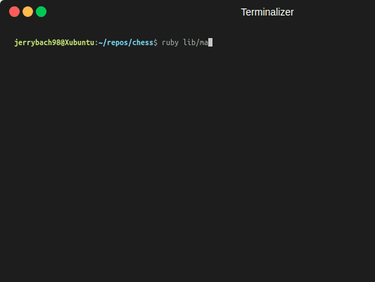

# Chess CLI Game
A command-line interface (CLI) chess game written in Ruby, offering multiplayer PVP or single-player against a computer AI.

## How to Play:
**Play Online:**\
\
Or to play locally, you must have Ruby installed. See [here](https://www.ruby-lang.org/en/downloads/) for more details. This program was written in Ruby 3.2.2. Clone this repository, navigate to the directory and type ruby lib/main.rb in your terminal.

## Live Demo:
 

## Tech Stack
- **Language:** Ruby
- **Testing:** RSpec

## Features:
* Modes: Users can compete against each other or against a computer AI. Enforces most rules of chess. 
* Move Input: Input moves using chess notation for piece selection then destination. For example, to move a piece enter "b2" then enter "b3".
* Saving: The game allows users to save their progress at any point serializing with JSON by typing 'save'.
* Castling: Players can select the King and enter the King's castle coordinates.
* Pawn Promotion: Promote pawn to a Queen by advancing it to the opposite side of the board.

## Lessons Learned:
* Complex CLI Game: Built an advanced command-line game with multiple features.
* Knowledge: Applied cumulative knowledge from past projects and learning to showcase understanding of fundamental concepts.
* Object-Oriented Programming: Implemented OOP principles for code organization, reusability, and maintainability. Structured with well-defined methods and classes in mind to promote understanding.
* Coding Logic and Integration: Demonstrated proficiency in coding logic, problem-solving, and integration of diverse components.
* Structured Approach: Broke down the game into logical steps to maintain a structured approach.
* Pseudocoding: Emphasized the importance of pseudocoding for better planning.
* RSpec Testing: Implemented RSpec testing for basic unit coverage and prevent self-testing redundancy.
* Code Reusability: Utilized method chaining and code reusability to minimize code.

## Further ehancements:
* Draw Criteria: Add more draw criteria, such as Threefold repetition, Fifty-move rule, and detecting dead positions.
* Advanced AI: Implement more advanced AI with recursion and breadth-first search for min-max algorithms.
* Board Flipping: Enable board flipping for both perspectives.
* Code Refactoring: Reduce redundant code for black and white pieces to further modularize the code.
* Pawn Promotion: Enhance pawn promotion by allowing choices beyond the default Queen.
* En Passant: Implement the en passant rule for more comprehensive gameplay.